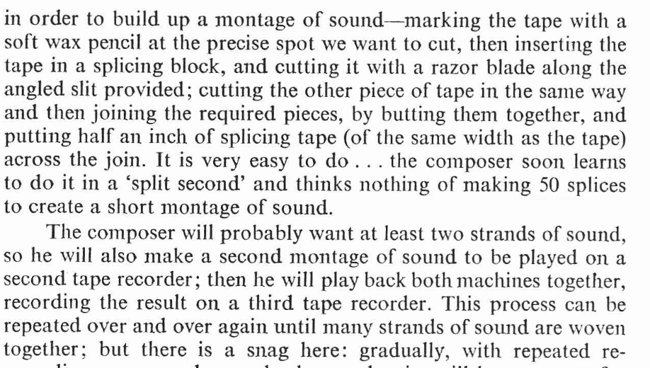

# STEM for Creatives Week 4 - Audio Cut and Paste

This week we will see how audio is represented on computers, how we can cut it up and rearrange it.

## (Uncompressed) Audio Files are just Lists 

Sound in the physical world is just __vibrations__ in air. Our ear picks these up, transfers them to mechanical motion, then electrical signals!

Precomputer (analog), we could record, replay, and amplify this using electrical cables 

In a digital world, we **can't represent a continuous signal**. Instead,  we __sample__ this signal (take a measurement at short intervals). 

This leaves us with a `List` of numbers (normally between -1 and 1) that represent some audio. 

## Librosa - Audio in Python

### Loading Samples

First, we're just going to use it to read in sound files, and maybe mess with their sample rates.

Using ```librosa.load()```, we get the sample data back as an array, as well as the sample rate of the file. Unless you specify, `librosa` will load in at 22050 samples a second. Once we have our samples, we can use `dot.music.start_sample_stream()` to play the audio out of the speakers.

```
99849 samples at 22050 lasts for 4.53 seconds
```

We'll then show you how you can manipulate the array and play it back and get some cool audio effects.

```python
#week4-waveform.py
def setup(self):
    audio, sr = librosa.load("audio/drums.wav")
    num_samples = len(audio)
    print(f"{num_samples} samples at {sr}Hz lasts for {(num_samples / sr):.2f} seconds")
    dot.music.start_sample_stream(audio, sr=sr)
```

### Format Strings

```python
print(f"{num_samples} samples at {sr}Hz lasts for {(num_samples / sr):.2f} seconds")
```

When we want incorporate existing variables nicely into our `print()` statements, we can use a `format string`. 

1. Prepend `f` in front of the `"`

2. Include the variable in `curly brackets {}`

3. `:.2f` after a number will allow us to specify a number of decimal places (in this case 2!).

### Visualising the Samples

We can see both the audio that is loaded in and the current playback position using the `dot.music.draw_waveform()` function. 

We pass it the place to draw to (`dot.canvas`), a colour to draw and a `boolean` as to whether to draw a playhead.

```python
#week4-waveform.py
def draw(self):
    dot.background((255,255,255))
    dot.draw_waveform(dot.canvas, col=dot.black, with_playhead=True)
```

# Cut and Paste in Python

We are not going to be *literally* cutting and pasting tape, or using specially designed hardware or software interfaces. We will be writing code and using our knowledge of indexing `Lists` that we learnt last week.

We have seen how to load in an audio file, and that this audio file is **just a `List`** of sample values

## Cutting 

### Indexing more than one item

First, we saw how we could use `named variables` to replace actual values (like numbers and text) in our code allowing for consistency, reuse and modularity. 

```python
bpm = 140
set_tempo(bpm)
```

Then, we saw how we could store a whole collection of values in a variable as a `List`. Individual items in these `List`s could be retrieved or overwritten using an index and `[]`, starting at 0. 

```python
#make a list
colour = [255,26,60]
#get an item
r = colour[0]
#update the list
colour[1] = 34
```

For our cutting purposes, we're going to need to select **more than one sample at a time**. We will need to select a **sequence of continguous samples**

Instead of giving an exact index for a row or column (getting us just one point), we can use the `[:]` notation to say "all of this row/column". We can also specify an exact range with `[start:end]`

```python
audio, sr = librosa.load("audio/drums.wav")
#Get from the beginning to sr (this is the first second)
beginning = audio[:sr]
print(len(beginning)) 
#Get from the (end - sr) to the end (this is the last second)
end = audio[-sr:]
print(len(end)) 
#Get from sr to sr*3 (this is second 1-3)
mid = audio[sr:sr*3]
print(len(mid)) 
```

### A Sidebar on Musical Timing

If you were to listen to the above samples, you would notice they just cut an almost random section out that doesnt seem to start or end in a particularly musical place. Thats because we gave an exact time in seconds, but the relationship between seconds and musical timing (beats, bars, tempo) is slightly more complex. 

The above drum beat is 99849 samples at 22050Hz lasts for 4.53 seconds. It is also 2 bars, each of which is 4 beats performed at 106 beats per minute (`bpm`) (see ``week4-bars.py``). 

Each `bar` represents a larger musical segment, made up of `beats` that represent the pulse of the music. The length in seconds of each of these beats is determined by the `bpm`. 

So if we wanted to chop out a musically relevant section, we could work out :

```python
samples_in_bar = len(audio) // 2
samples_in_beat = samples_in_bar // 4
#This is the first beat
beginning = audio[:samples_in_beat]
print(len(beginning)) 
#This is the last beat
end = audio[-samples_in_beat:]
print(len(end)) 
#This is the middle of bar 1, the second and third beats
mid = audio[samples_in_beat:samples_in_beat*3]
print(len(mid)) 
```

## Pasting

In order to paste our spliced audio, we need

1. Another `List` to copy it to

2. A Location (in samples) of where to paste

### Overwriting 

The best way to think about this is that it is the same process as overwritting a variable, but just you are overwritting a whole section of a `List`

We provide the `[start:end]` and the thing you are copying in **must be the same size**. With this operation, we remove all of the old audio and insert some new audio.

```python
#week4-paste.py
#Load audio
audio, sr = librosa.load("audio/keys4.wav")
audio2, sr = librosa.load("audio/harp1.wav")
#How many samples?
samples_in_bar = len(audio) // 2
samples_in_beat = samples_in_bar // 4
#Cut
cut = audio2[:samples_in_beat*2 ]
#Overwrite
audio[samples_in_beat:samples_in_beat*3] = cut
```

### Mixing

We can also combine two audio files together using a simple `+` operation. This works with `Lists` that are the same size and does an `item-wise addition`. This means this first two items are added, then the second, then the third etc...This `item-wise` arithmetic will work with `-`,`*` and `/` as long as **the lists are the same length**.

This ends up with both samples layered on top of each other.

```python
#week4-mix.py
#Load audio
dot.music.start_sample_stream(audio + drums, sr=sr)
```

## Editting Snippets

When you've cut something out, you might want to edit it first before you copy it back in

### Volume

We can adjust the volume of a sample by making all the numbers smaller or bigger (more on the perception of sound next week).

Here, we make every sample 20% of its original value. Quieter!

```python
#week4-quieter.py
audio_output = drums * 0.2
```

### Fade In 

We can also use an `item-wise multiplication` and a ramp the same length of our audio file to make a fade in 

```python
#week4-fadein.py
ramp = np.linspace(0,1,len(drums))
audio_output = drums * ramp
```

### Reverse

```python
#week4-reverse.py
#Just reverse the array
audio_output = np.flip(drums)
```

### Changing the playback rate 

We can change the sample rate and this effects the length and the pitch of an audio file. This is analagous to playing a record player faster or slower. 

Essentially, we take **same numbers / samples** and either interpret them to represent **more or less time**

For example, if the sample rate is 44100Hz, then 44100 samples represents 1 second of sound. At 22050Hz, 44100 samples represents 2 seconds of sound

Taking the **same numbers / samples** and playing at a lower sample rate, means we take longer to play through the samples and it sounds lower.

Taking the **same numbers / samples** and playing at a higher sample rate, means we move through the samples quicker and it sounds higher.

```python
#week4-faster.py
#We can play at a different speed (higher sample rate = faster playback)
#Also half the length
dot.music.start_sample_stream(audio_data, sr = sr*2)
```
```python
#week4-slower.py
#We can play at a different speed (lower sample rate = slower playback)
#Also, twice the length
dot.music.start_sample_stream(audio_data, sr = sr/2)
```
## The Third Tape Recorder - Exploration

Daphne Oram, An Individual Note of Music, p.62

To make our audio collages, we have been pasting into an existing audio file, but there is no reason to do this. We can first make a blank canvas (a third tape recorder), and then paste into this. 

```python
audio, sr = librosa.load("audio/drums.wav")
#Make 60 of silence
blank_audio = np.zeros(sr*60)
#Define insert point in samples
start = 3*sr
#How long is our audio to paste in?
end = start + len(audio)
#Paste into blank track
blank_audio[start:end] = audio
```

This week we'll be making audio collages.

For this exercise, your task is to create a unique sound collage by sourcing and manipulating a variety of audio clips. These can come from any sound material you find interesting—music, environmental recordings, spoken word, or other found sounds. You will use basic cut-and-paste operations to assemble these clips into a new composition, experimenting with the following techniques:

* Adjust the volume of individual clips to emphasise particular moments or create dynamic contrast within your piece.

* Cut and rearrange or repeat certain subsections of a longer sample.

* Use fades to control how sounds enter and exit, smoothing transitions or creating more abrupt changes.

* Experiment with reversing audio to see how this transforms the texture and meaning of the original sound.

* Change the speed of some clips, exploring how slowing down or speeding up affects their qualities and their role in the composition.

If you want to examine a sample to find good cut points, I'd recommend the free software [Audacity](https://www.audacityteam.org/download/)

As you work, consider whether your approach is more abstract focusing on creating unexpected juxtapositions and sound textures, or more musically sequenced, following a rhythmic or melodic pattern. Think about when you want to overwrite—replacing one sound with another, and when to mix sounds together.

Your final piece should reflect your creative decisions and the editing techniques you've applied.

