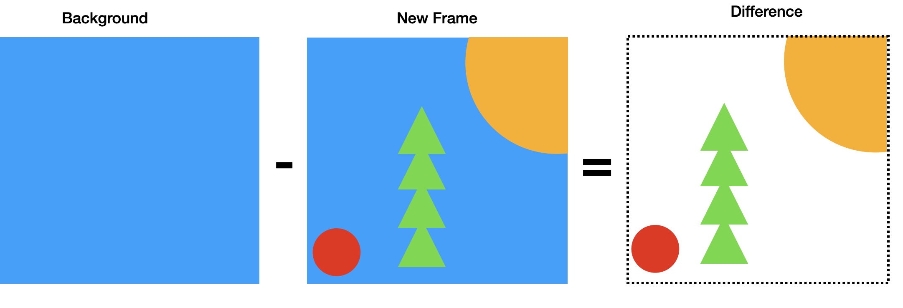
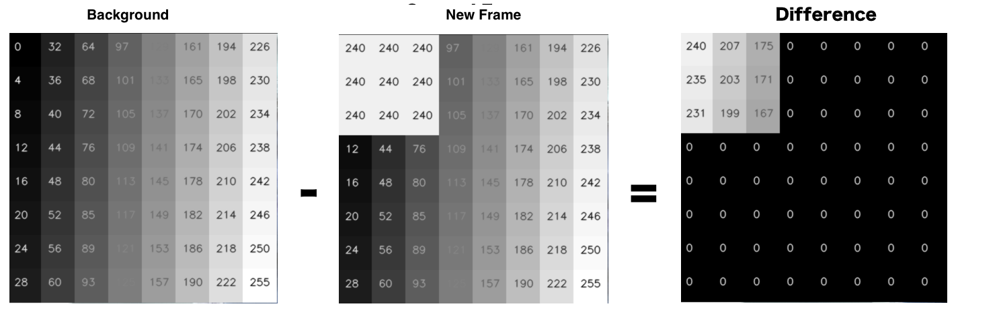
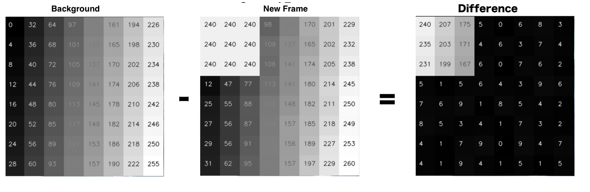
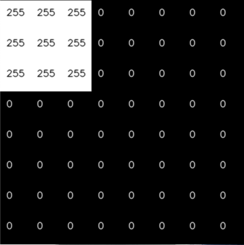
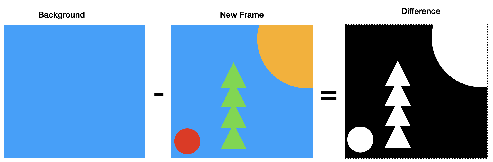
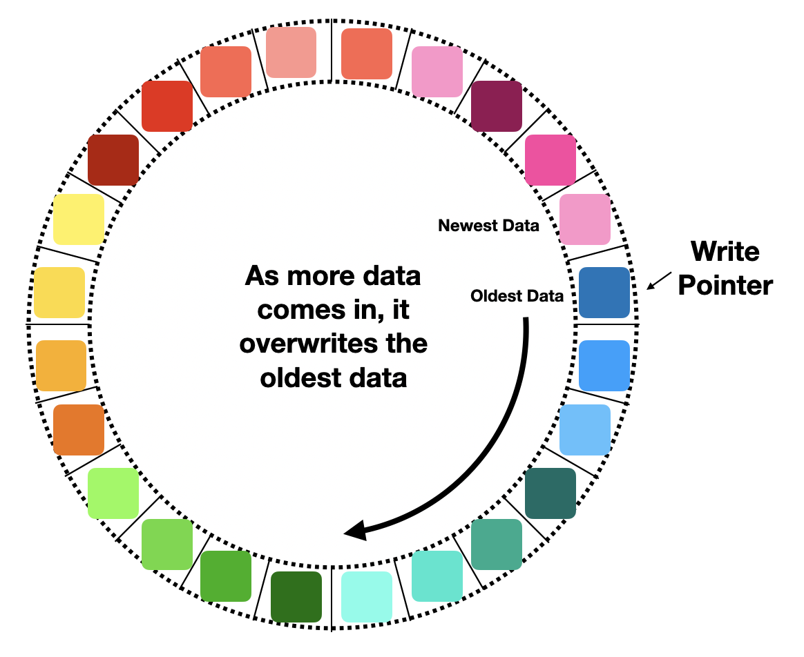

# Week 7 Working With Video

This week we are going look at 


* OpenCV (for video analysis)


* Background Subtraction 


* Thresholding 


* Ring Buffers


* Face and Eye Tracking + Making our own filters!
 
### Getting the webcam feed

```python
#week7-video-capture.py
def draw(self):
    #Pull in frame
    success, camera_feed = self.camera.read()
    if success==True:
        #Convert color
        camera_feed = cv2.cvtColor(camera_feed, cv2.COLOR_BGR2RGB)
        #Resize to canvas size
        camera_feed = cv2.resize(camera_feed,(dot.width, dot.height))
        #Write to screen
        dot.canvas = camera_feed
```

#### ```cv2.VideoCapture()```, ```.read()```

We can use the ``VideoCapture`` object to pull in new frames from the webcam. The ``.read()`` function returns us a new image (which we store in the variable ``camera_feed``), and a **boolean** value telling us whether it worked or not (which we store in the variable ``success``). We convert back to RGB colour space, resize to the size of the ``an.canvas`` and overwrite it so it gets displayed in the window.


#### A note on frame rate

There is a time cost to grabbing a frame from the webcam. 

There is also some time introduced by use analysing the frame, or editting it somehow.

All of this introducing latency until we can go back to the top of the ``def draw():`` function to get another frame. Depending on how complicated the calculations we are doing are, depends on how quickly we can get a new frame. 

The amount of new frames we can grab in a second is known as the **Frame rate**. 

### Background Subtraction

```python
#week7-background-sub.py
#Absolute difference between current frame and first frame (background)
diff = cv2.absdiff(camera_feed, self.camera_background)
```
[Demonstration Video](images/BackgroundSubtractionCV2.mp4)

To detect movement, or new objects or people in a frame, one technique we can use is **Background Subtraction**. 

Here, we subtract all of the pixel values from the current frame from all of the pixel values from a background frame. 

Whats left is anything that has changed!

#### Imagine a painting 

Imagine you have a large canvas that's painted a uniform shade of blue, representing the background. Now, let's say you start painting various objects on this canvas in different colours, such as a red apple, a green tree, and a yellow sun. These objects represent the foreground.

To identify and separate the foreground objects from the blue background, you can think of background subtraction as trying to determine which parts of the canvas have a different colour than blue. You would compare each spot on the canvas to see how much it differs from blue.

We can save the the first frame in the ``background`` variable and use this to compare to the new frame next time around. We can use the ``cv2.absdiff()`` function to do this. 




#### Absolute Difference 

When subtract one thing from another, there are 3 possible outcomes 

1. 0 (if they are the same)


2. A positive number (if the first number is bigger than the second)


3. A negative number (if the first number is bigger than the second)


If all we care about is **how much things are different**, not which direction, we use the ``absolute difference``. The result of this calculation is **always positive**

The absolute difference in the context of our landscape painting is like noting how different each spot's colour is from blue without considering whether it is lighter or darker, just focusing on the extent of the difference. For instance, the red apple would differ greatly from blue, while a slightly different shade of blue would have a small difference.

Running ``week7/week7-background-sub.py``, you will see that this doesn't actually work that well, we more see an imprint of the background image over the new video frames. How do we know that the person in the foreground in the new thing thats moving at the background is remaining constant?

### Thesholding



After calculating this difference for every spot, the next step is thresholding. Thresholding is akin to deciding a cut-off point in the difference in colour where you say, "If the colour difference is greater than a certain value, it's not blue, hence it’s part of the foreground." This is like setting a rule that any spot significantly different from blue should be marked as part of the apple, tree, or sun, and not part of the background.

Things are either **old / part of the background** (0) or they are **new** (255). 

For our camera, small changes are often not new objects, just small differences caused by noise in the camera, shadows, changes in lights. We can set a **threshold** where any changes larger than this become 255, and anything lower than this are set to 0.

We can do this in OpenCV using the ``cv2.threshold()`` function. We lose all the small changes, and keep the big ones (over the threshold).




### Experiment

Try the code below and change the ``threshold`` value. See it effects what gets filtered out. What happens when you set it 0? What about 255?

## Using a Model 

What do we mean when we say **background**?

Previously, this has just been how the world when we turned on the camera (the first frame). Often, we want to avoid small changes to the background when doing our subtraction, and even incorporate new things that have changed (and become the background) over time. 

In this case, we want to build some kind of model of our background over time. One approach is to take **an average of the camera feed over a given window**. Anything that hangs around long enough becomes part of the background!

### Ring Buffer

```python
#week7-circular-buffer.py
#Update mask with mean pixel values from buffer (axis 0 is time!)
self.model = np.mean(self.buffer, axis=0).astype(dtype=np.uint8)

#Update the circular buffer
self.write_ptr = (self.write_ptr + 1) % self.window_size
self.buffer[self.write_ptr] = camera_feed
```

The approach towards this we'll see is by collecting all the frames into a new list as they come in. Then each time, we'll get the ``mean`` of these frames and us that to subtract the new camera data against. 

The data structure we'll use is a ``Ring Buffer``. This just means we have a list of a pre-defined length and each time we get new data, we are adding it into a point in the list that contains the oldest piece of data. 

This means we always have a list / buffer of the most recent frames and are constantly overwriting old data as it becomes less relevant.

[Demonstration Video](images/RingBufferAnimation.mp4)



In the code, we have a pointer that moves forward each time telling us where the new data goes. We use the ``modulo (%)`` function to wrap back round to the beginning when we go off the end.

### Experiment

Try the code below and change the ``window_size`` value. See how it effects what gets filtered out. What happens when its 2 (very short memory). What happens when its 100 (long memory)?

Change the ``dot.canvas = `` part of the code to display ``self.model`` instead of the thresholded image. Watch it gradually update over time.

### Task 1 (complete in pairs)

Run through the ``Experiments`` in the above code

### Task 2 (complete in pairs)

Check out these 3 camera based sensing methods. They all run in the browser (Try Firefox or Chrome!). Models may take some time to load first time so be patient if screen blank for a minute or two!

* How well do they work?

* What parts / actions / conditions are they good at tracking?

* What makes them fail? Obscuring things with objects, different lights, multiple people / faces/ hands, moving quickly?


1. [MoveNet](https://mimicproject.com/code/8a60a7b7-6277-2b4f-8aae-389f7b49ca1c?embed=true)


2. [FaceMesh](https://mimicproject.com/code/8aa114c7-3e87-5ef6-e81e-151c5cd9a38a?embed=true)


3. [HandTrack](https://mimicproject.com/code/d1c15d10-1071-a6a2-ac9c-82447150d771?embed=true)


## Make your own filter

[Face Filter Example](week7-face-filter.py)

Here we have some Python code to get the ``bounding boxes`` (x and y coordinates, width and height of object) for faces

### Task 3 

Use the shape functions in ``Dorothy`` to draw some accessories to your camera feed 


* Sunglasses?


* A Crown?


* A halo?


* New hair?


* Alien Attena?


* Cartoon eyes?

